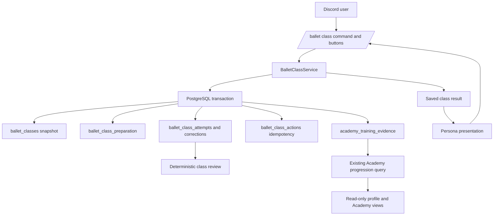

# Ballet class domain

The class system extends the existing Ballet and Academy domains. It reuses
the canonical 19-stage curriculum and the six rows in ballet_stats; it does
not create a second skill, XP, wallet, or Academy rank store.

Class type and exercise definitions live in TypeScript domain catalogs.
Starting a session filters the section plan by the user's current Academy
stage and saves a versioned curriculum snapshot. Before an assessment baseline
exists, the evidence-only resolver supplies that stage; otherwise the persisted
assessment-controlled stage is used. A partial unique
index allows one PREPARING or IN_PROGRESS class per user. The user row lock
serializes starts, preparation updates, class transitions, and attempts with
the existing Ballet mutation paths.

Every mutating component uses its Discord Interaction ID as a persistent
idempotency key and records a request fingerprint. A new exercise attempt
samples one injected random value, evaluates the existing Ballet stats and
saved preparation, then records its outcome, score, roll, snapshots, and
correction in the same transaction. Replays return the stored attempt.
Expected-exercise IDs make old buttons stale rather than letting a duplicate
delivery attempt a later exercise.

Class completion stores a review derived only from saved results and appends
class, section, and successful-exercise evidence. The current Academy query
can use completed class/section evidence for its existing activity-code
requirements. The class engine does not change XP, Ballet stats, wallet,
inventory, permissions, or the existing deterministic /performance command.

Migration 022 adds class sessions, preparation marks, action idempotency,
attempt/correction history, and Academy training evidence. It is additive and
has not been applied to any production database in this work.

Assessment V1 consumes a class's stored Practical review and does not rerun
exercise RNG. Stage baselines, assessment attempts, answers, and promotions are
documented in [Academy Assessments V1](academy-assessments.md).
